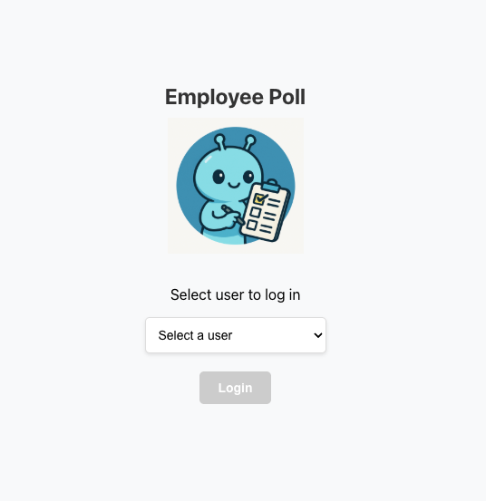
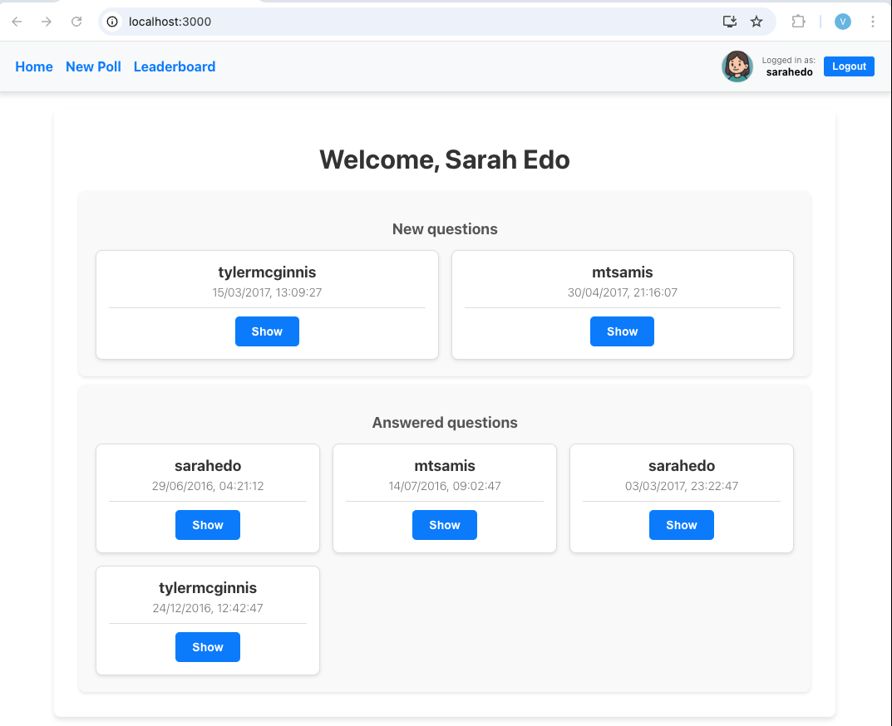
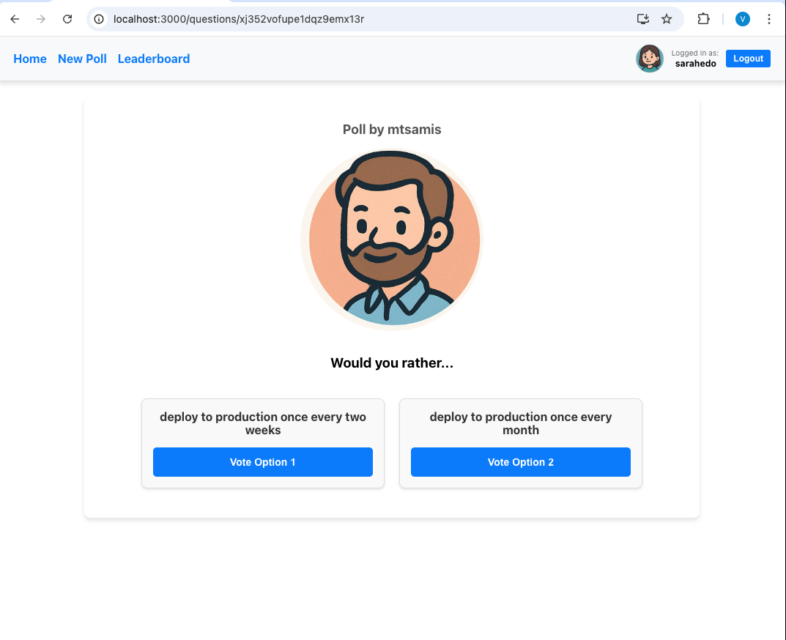
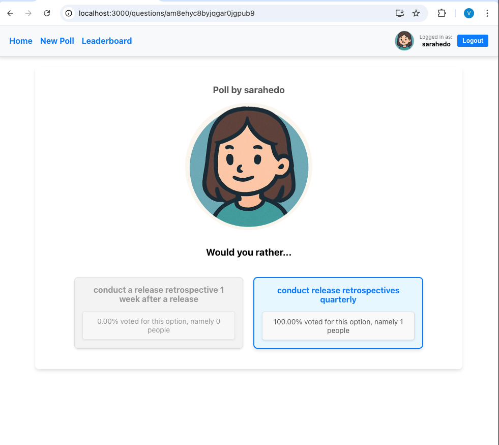

# Employee Polls Application

## Overview

The Employee Polls application is a React-based web app that allows users to create polls, answer polls, and view poll results. It is designed to showcase key features of React, Redux, and React Router, including state management, routing, and component-based architecture.

### Features

- **Login Page**: Users can log in by selecting their username from a dropdown menu.
- **Dashboard**: Displays a list of polls categorized into "Answered" and "Unanswered".
- **Polls**:
  - **Unanswered Polls**: Users can vote on a poll by selecting one of the options.
  - **Completed Polls**: Displays the results of a poll, including the percentage of votes for each option.
- **Leaderboard**: Shows the ranking of users based on the number of polls created and answered.
- **New Poll**: Allows users to create a new poll by providing two options.

### Screenshots

#### Login Page

#### Dashboard (Home)

#### Unanswered Poll

#### Completed Poll

### Technologies Used

- **React**: For building the user interface.
- **Redux**: For state management.
- **React Router**: For routing between pages.
- **TypeScript**: For type safety and improved developer experience.
- **Jest & React Testing Library**: For unit testing and integration testing.

### Available Scripts

In the project directory, you can run:

#### `npm install`
Installs dependencies required for the project.

#### `npm start`
Runs the app in development mode.\
Open [http://localhost:3000](http://localhost:3000) to view it in the browser.

#### `npm test`
Launches the test runner in interactive watch mode.

#### `npm run build`
Builds the app for production to the `build` folder.

#### `npm run eject`
Removes the single build dependency and copies configuration files for customization.